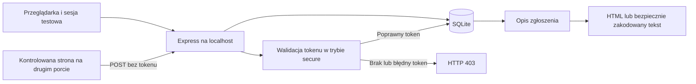

# Powiązanie aplikacji z kartą projektu P7

Karta projektu określa cel: wykazać XSS/CSRF w autoryzowanym laboratorium, wdrożyć ochronę i udokumentować BEFORE → AFTER. Poniższe mapowanie dotyczy aplikacji i dostępnych dowodów; nie oznacza zakończenia raportu ani obrony projektu.

## Zakres i model zagrożeń

Chronione zasoby: sesja zalogowanego użytkownika, dane profilu, treść zgłoszeń i poprawność interfejsu. Granica zaufania XSS: opis zapisany w bazie → HTML w przeglądarce. Granica zaufania CSRF: obca strona → żądanie wykonywane z cookie użytkownika → operacja zmiany danych.

Atakujący laboratoryjny kontroluje opis zgłoszenia albo własną stronę z formularzem. Dysponuje wyłącznie kontem testowym i fikcyjnymi danymi. Poza zakresem pozostają cudze konta, produkcja, dane pacjentów i publiczne serwisy. Nie testujemy przejęcia sesji ani eksfiltracji danych.

## Ryzyko i priorytet

Ocena jakościowa, nie wyliczenie CVSS: w aplikacji laboratoryjnej rzeczywisty wpływ jest ograniczony do fikcyjnych danych. W analogicznym systemie produkcyjnym Stored XSS ma wysoki priorytet ze względu na wykonanie kodu w kontekście aplikacji i możliwość modyfikacji interfejsu lub operacji w sesji. CSRF ma wysoki priorytet dla zmian danych wykonywanych w aktywnej sesji bez potwierdzenia intencji użytkownika. Faktyczna możliwość ataku zależy także od SameSite, origin i rodzaju żądania.

Remediacja XSS: kodowanie danych przy renderowaniu w kontekście tekstu HTML, CSP jako dodatkowa warstwa. Remediacja CSRF: losowy token związany z sesją, odrzucenie żądań bez poprawnego tokenu, SameSite=Strict jako dodatkowe ograniczenie. HttpOnly ogranicza odczyt cookie z JavaScript, ale nie zapobiega samemu XSS. Secure ogranicza wysyłanie cookie do HTTPS.

## Odniesienia

- [OWASP Top 10:2025](https://owasp.org/Top10/2025/): dokument opisujący kategorie ryzyk aplikacji. W projekcie używany jako kontekst ryzyka XSS, braku kontroli żądań i konfiguracji zabezpieczeń; nie stanowi certyfikacji aplikacji.
- [OWASP ASVS 5.0.0](https://github.com/OWASP/ASVS/tree/v5.0.0): wymagania kontroli aplikacyjnych. Tematy mapowania: encoding/sanitization dla T1/T2, bezpieczeństwo przeglądarki i kontrola CSRF dla T3–T5, konfiguracja nagłówków i sesji dla T6. To mapowanie tematyczne, nie deklaracja spełnienia całego ASVS.
- [OWASP WSTG 4.2 — Stored XSS](https://owasp.org/www-project-web-security-testing-guide/v42/4-Web_Application_Security_Testing/07-Input_Validation_Testing/02-Testing_for_Stored_Cross_Site_Scripting): metodyka weryfikacji zapisu danych i późniejszego wykonania w przeglądarce.
- [OWASP WSTG 4.2 — CSRF](https://owasp.org/www-project-web-security-testing-guide/v42/4-Web_Application_Security_Testing/06-Session_Management_Testing/05-Testing_for_Cross_Site_Request_Forgery): weryfikacja żądań zmieniających stan w sesji użytkownika.

## Dowody i kryteria akceptacji

| Kryterium karty | Artefakt / stan |
| --- | --- |
| Legalny zakres | Serwer loopback, testowe konto, kontrolowane payloady |
| Odtwarzanie | package-lock.json, .env.example, README, skrypty npm |
| Dowód techniczny | Podgląd XSS, before/observed i niezależny GET profilu CSRF, requesty i odpowiedzi, PNG/JSON |
| Remediacja | Wspólne renderDescription/escapeHtml, verify, Helmet, cookie dla HTTP/HTTPS |
| Re-test | Widoczna tabela porównania, testy integracyjne i przeglądarkowe |
| Standardy i ryzyko | Mapowanie tematyczne i ocena powyżej; do rozwinięcia w raporcie |
| Raport 8–12 stron | Pozostaje osobnym dokumentem zespołu; eksport JSON nie zastępuje raportu |
| Obrona 10–12 minut | Poniższy plan demo; przygotowanie zespołu pozostaje do wykonania |

## Proponowany przebieg obrony

1. Cel, zakres i zasoby (1–2 min).
2. Uruchomienie podatnej wersji, XSS i zmiana profilu bez tokenu (3 min).
3. Włączenie kodowania, CSRF, CSP i ponowienie testów (3 min).
4. Porównanie dowodów, legalne żądanie i cookie HTTPS (2 min).
5. Ryzyko, ograniczenia i wnioski (1–2 min).

Zielony wynik w trybie secure oznacza spełnienie konkretnego scenariusza. Nie oznacza kompletnego bezpieczeństwa całej aplikacji. Hasła testowe i sesje w pamięci procesu pozostają elementami lokalnego laboratorium.
